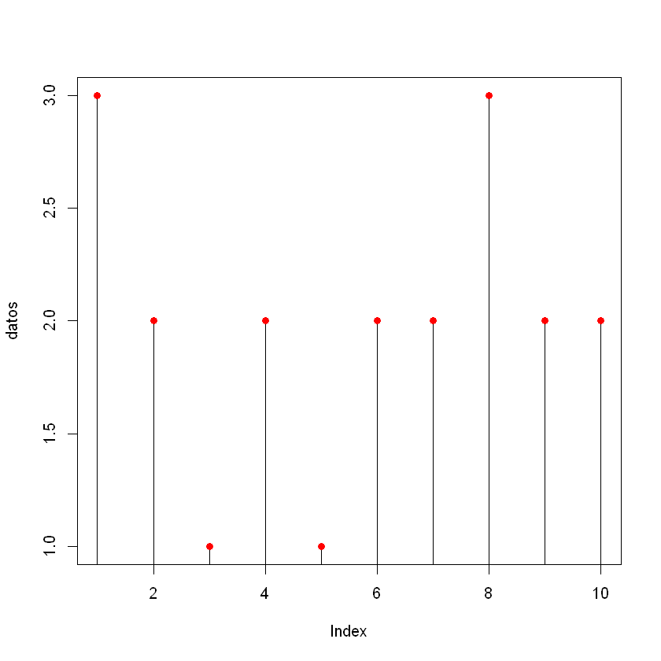
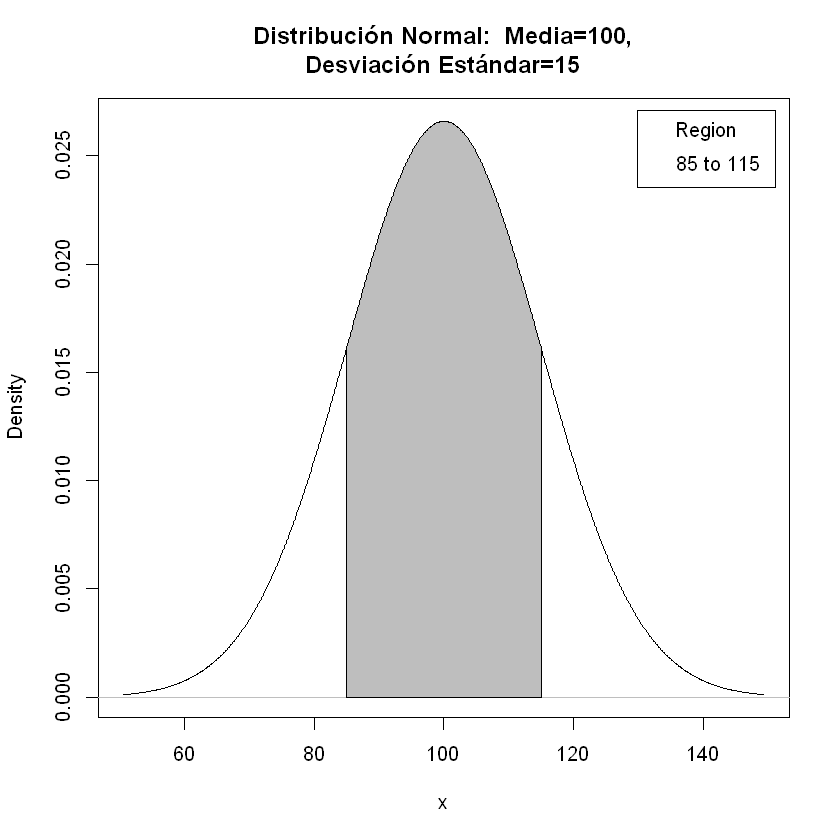
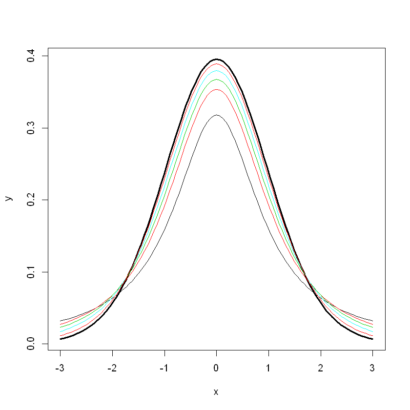
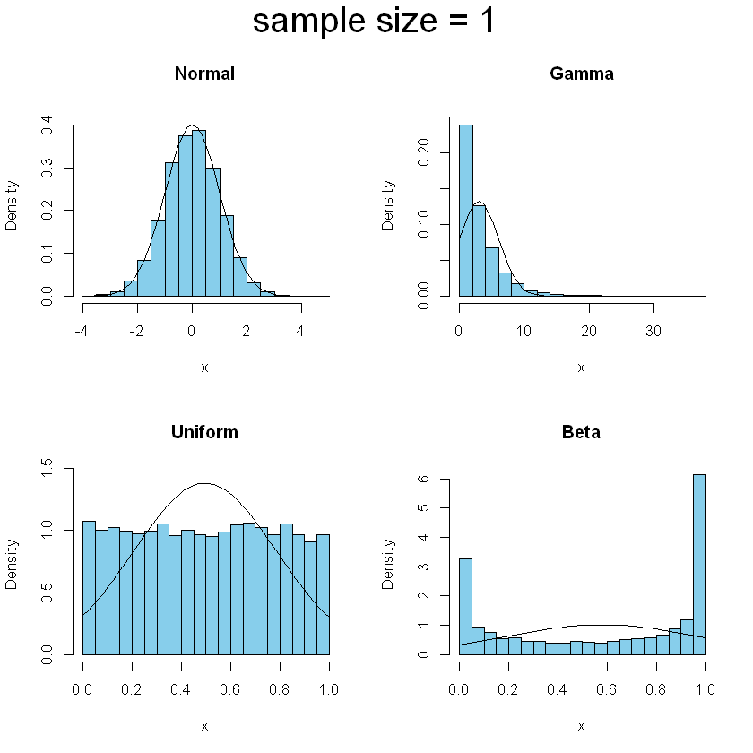
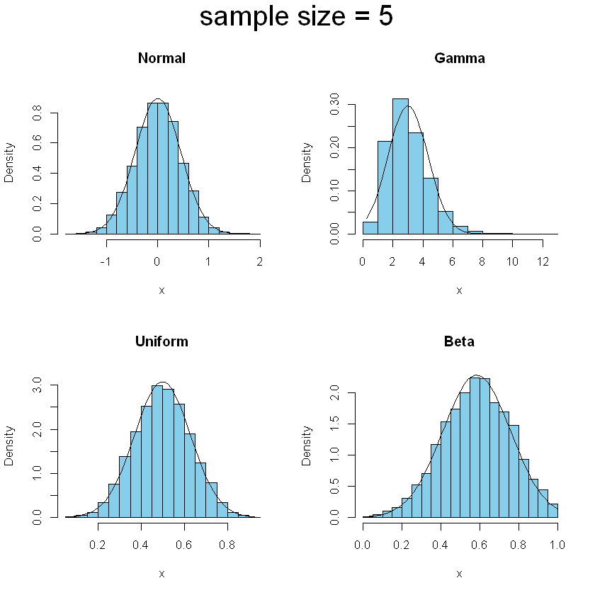
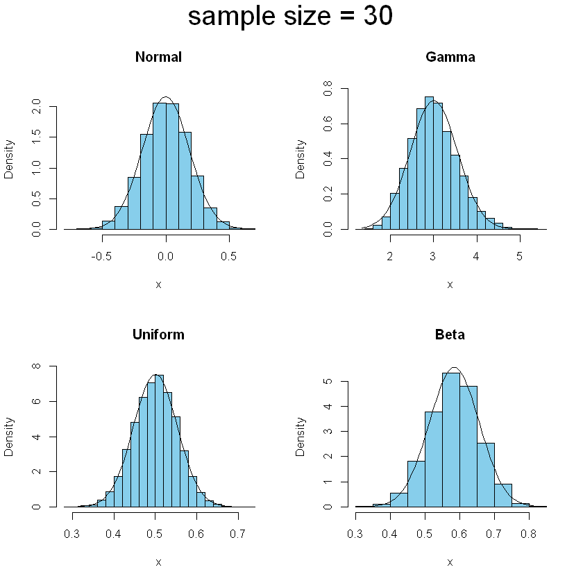
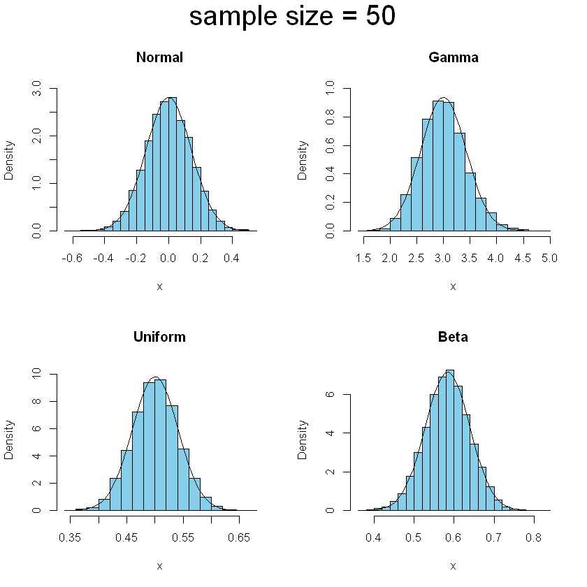
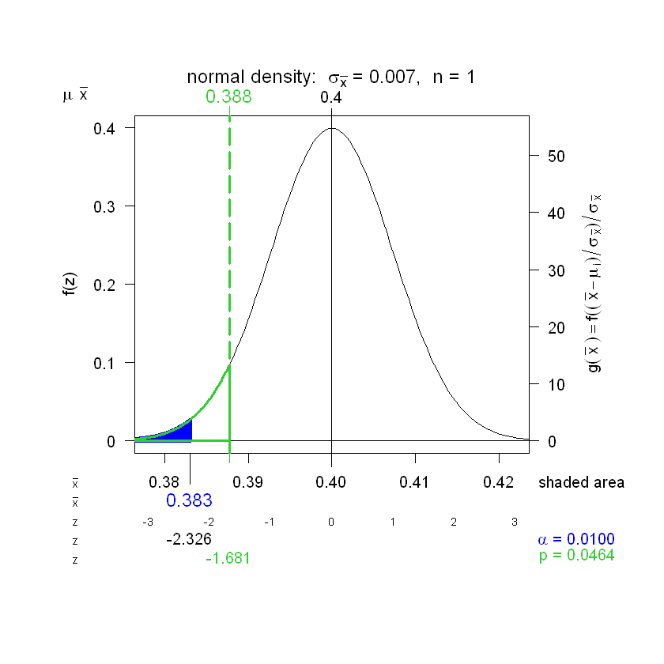

# Probabilidades e Inferencia Estadística - Taller Práctico Usando R

## 1. Distribuciones Discretas

### 1.1. Ejemplo lanzamiento de una moneda:

Se lanza 3 veces una moneda. Describir el espacio muestral, calcular la media, la varianza y la desviación estándar:

#### Solución

Se definen los posibles resultado $(x=Cara)$:
\[
S(x) = {0,1,2,3}
\]

Y el Espacio Muestral:
$$
S = \{CCC; CSC; SCC; SSC; CCS; CSS; SCS; SSS\}
$$

Ahora, ¿Cómo queda la frecuencia?

| $x S(x)$ | $fX(x)=P(X=x)$ |
|----------|----------------|
|    $0$   |   $\frac{1}{8}$|
|    $1$   |   $\frac{3}{8}$|
|    $2$   |   $\frac{3}{8}$|
|    $3$   |   $\frac{1}{8}$|
|  $Total$ |            $1$ |

Ahora, calculemos (manualmente):

##### Media


```R
x <- c(0,1,2,3)
f <- c(1/8, 3/8, 3/8, 1/8)
mu<-sum(x*f); mu
```


1.5


##### Varianza


```R
sigma2 <- sum((x-mu)^2 * f); sigma2
```


0.75


##### Desviación Estándar


```R
sigma<-sqrt(sigma2); sigma
```


0.866025403784439


##### Función de Probabilidad Acumulada


```R
F<-cumsum(f); F
```


<ol class=list-inline>
	<li>0.125</li>
	<li>0.5</li>
	<li>0.875</li>
	<li>1</li>
</ol>


Ahora, el cálculo usando un comando específico. Se requiere el paquete ```distrEx```


```R
library(distrEx)
X <- DiscreteDistribution(supp = 0:3, prob = c(1,3,3,1)/8)
E(X); var(X); sd(X)
```


1.5


0.75


0.866025403784439


### 1.2. Distribución Binomial

Ejemplo de la probabilidad del sexo de los hijos en una familia de 4 hijos:

#### Probabilidad


```R
dbinom(0:4,size=4,prob=1/2)
```


<ol class=list-inline>
	<li>0.0625</li>
	<li>0.25</li>
	<li>0.375</li>
	<li>0.25</li>
	<li>0.0625</li>
</ol>


#### Función de Probabilidad Acumulada


```R
pbinom(0:4,size=4,prob=1/2)
```


<ol class=list-inline>
	<li>0.0625</li>
	<li>0.3125</li>
	<li>0.6875</li>
	<li>0.9375</li>
	<li>1</li>
</ol>


Ahora, simulemos una muestra de 10 familias


```R
datos<-rbinom(10,size=4,prob=1/2); datos
```


<ol class=list-inline>
	<li>3</li>
	<li>2</li>
	<li>1</li>
	<li>2</li>
	<li>1</li>
	<li>2</li>
	<li>2</li>
	<li>3</li>
	<li>2</li>
	<li>2</li>
</ol>


```R
plot(datos,type="h")
points(datos,pch=19,col="red")
```





### 1.3. Distribución Hipergeométrica

Ejemplo balotas en una urna, hay 12 de las cuales 7 son blancas y 5 negras. Si se seleccionan 4 balotas, ¿cuál es la probabilidad que 3 sean blancas y 1 negra?

Si consideremos como éxito las balotas blancas, entonces se escribe


```R
dhyper(3, m = 7, n = 5, k = 4)
```


0.353535353535353


Ahora, ¿cuál es la probabilidad para cada uno de los casos?


```R
A <- data.frame(Pr = dhyper(0:4, m = 7, n = 5, k = 4))
rownames(A) <- 0:4
A
```


<table>
<thead><tr><th></th><th scope=col>Pr</th></tr></thead>
<tbody>
	<tr><th scope=row>0</th><td>0.01010101</td></tr>
	<tr><th scope=row>1</th><td>0.14141414</td></tr>
	<tr><th scope=row>2</th><td>0.42424242</td></tr>
	<tr><th scope=row>3</th><td>0.35353535</td></tr>
	<tr><th scope=row>4</th><td>0.07070707</td></tr>
</tbody>
</table>


## 2. Distribuciones Continuas

### 2.1. Distribución Normal

#### Ejemplo de IQ
Un grupo de personas toma un test de IQ donde la media es 100 y la desviación estándar es 15. Cuál es la probabilidad que el puntaje obtenido esté entre 85 y 115?

Primero, definamos gráficamente el problema:


```R
library(RcmdrMisc)
x <- seq(50.642, 149.358, length.out=1000)
plotDistr(x, dnorm(x, mean=100, sd=15), cdf=FALSE, xlab="x", ylab="Density", main=paste("Distribución Normal:  Media=100,
Desviación Estándar=15"), 
  regions=list(c(85, 115)), col=c('#BEBEBE', '#BEBEBE'), legend.pos='topright')
```





Ahora, realicemos el cálculo


```R
pnorm(115,mean=100,sd=15) - pnorm(85,mean=100,sd=15)
```


0.682689492137086


Analicemos algunas situaciones:
1. ¿La probabilidad que sea superior a 115?
2. ¿Que sea inferior a 85?
3. ¿Que significa el siguiente resultado?


```R
qnorm(pnorm(115,mean=100,sd=15))
```


1


### 2.2. Distribución T-Student

### Gráfica


```R
curve(dt(x, df = 30), from = -3, to = 3, lwd = 3, ylab = "y")
ind <- c(1, 2, 3, 5, 10)
for (i in ind) curve(dt(x, df = i), -3, 3, add = TRUE,col=i)
```





Calcular $t(0.05)$ con en una muestra de tamaño 15


```R
qt(0.05, df = 14, lower.tail = FALSE)
```


1.76131013577489


### 2.3. Teorema del límite central


```R
library(TeachingDemos)
example(clt.examp)
```

    
    clt.xm> clt.examp()
    
    clt.xm> clt.examp(5)
    





    
    clt.xm> clt.examp(30)
    





    
    clt.xm> clt.examp(50)
    








## 3. Intervalos de Confianza

### 3.1. Intervalo de Confianza para Medias

En la base de datos PlantGrowth calcular el IC para el peso. Veamos la base de datos:


```R
summary(PlantGrowth)
```


         weight       group   
     Min.   :3.590   ctrl:10  
     1st Qu.:4.550   trt1:10  
     Median :5.155   trt2:10  
     Mean   :5.073            
     3rd Qu.:5.530            
     Max.   :6.310            


El intervalo de confianza se obtiene:


```R
with(PlantGrowth, z.test(weight, stdev = 0.7))
```


    
    	One Sample z-test
    
    data:  weight
    z = 39.694, n = 30.0000, Std. Dev. = 0.7000, Std. Dev. of the sample
    mean = 0.1278, p-value < 2.2e-16
    alternative hypothesis: true mean is not equal to 0
    95 percent confidence interval:
     4.822513 5.323487
    sample estimates:
    mean of weight 
             5.073 
    


Para la diferencia de medias, el IC se obtiene:


```R
with(PlantGrowth, t.test(weight))
```


    
    	One Sample t-test
    
    data:  weight
    t = 39.627, df = 29, p-value < 2.2e-16
    alternative hypothesis: true mean is not equal to 0
    95 percent confidence interval:
     4.811171 5.334829
    sample estimates:
    mean of x 
        5.073 
    


Se puede cambiar el nivel de significancia $\alpha$ (o el de confianza $1-\alpha$)


```R
with(PlantGrowth, t.test(weight,weight-1,conf.level = 0.80))
```


    
    	Welch Two Sample t-test
    
    data:  weight and weight - 1
    t = 5.5234, df = 58, p-value = 8.197e-07
    alternative hypothesis: true difference in means is not equal to 0
    80 percent confidence interval:
     0.7653054 1.2346946
    sample estimates:
    mean of x mean of y 
        5.073     4.073 
    


### 3.2. Intervalo de Confianza para Proporciones


```R
library(Hmisc)
```

Calcular el intevalo de confianza para 7 éxitos en 25 eventos


```R
binconf(x = 7, n = 25, method = "asymptotic")
```


<table>
<thead><tr><th></th><th scope=col>PointEst</th><th scope=col>Lower</th><th scope=col>Upper</th></tr></thead>
<tbody>
	<tr><th scope=row></th><td>0.28     </td><td>0.1039957</td><td>0.4560043</td></tr>
</tbody>
</table>


Veamos cuántos métodos posibles hay:


```R
binconf(x = 7, n = 25, method = "all")
```


<table>
<thead><tr><th></th><th scope=col>PointEst</th><th scope=col>Lower</th><th scope=col>Upper</th></tr></thead>
<tbody>
	<tr><th scope=row>Exact</th><td>0.28     </td><td>0.1207167</td><td>0.4938768</td></tr>
	<tr><th scope=row>Wilson</th><td>0.28     </td><td>0.1428385</td><td>0.4757661</td></tr>
	<tr><th scope=row>Asymptotic</th><td>0.28     </td><td>0.1039957</td><td>0.4560043</td></tr>
</tbody>
</table>


## 4. Pruebas de Hipótesis

### 4.1. Pruebas de Hipótesis para Proporciones

Ejemplo: admitidos a UCB (University of California at Berkeley): Históricamente la proporción de admitidos ha sido de 40% con un nivel de significancia de 0.01 la proporción de admitidos para 1973 es menor que la histórica?


```R
library(IPSUR)
library(HH)
A <- as.data.frame(UCBAdmissions)
head(A)
```


<table>
<thead><tr><th scope=col>Admit</th><th scope=col>Gender</th><th scope=col>Dept</th><th scope=col>Freq</th></tr></thead>
<tbody>
	<tr><td>Admitted</td><td>Male    </td><td>A       </td><td>512     </td></tr>
	<tr><td>Rejected</td><td>Male    </td><td>A       </td><td>313     </td></tr>
	<tr><td>Admitted</td><td>Female  </td><td>A       </td><td> 89     </td></tr>
	<tr><td>Rejected</td><td>Female  </td><td>A       </td><td> 19     </td></tr>
	<tr><td>Admitted</td><td>Male    </td><td>B       </td><td>353     </td></tr>
	<tr><td>Rejected</td><td>Male    </td><td>B       </td><td>207     </td></tr>
</tbody>
</table>


Construyamos la Tabla de Frecuencias:


```R
xtabs(Freq ~ Admit, data = A)
```


    Admit
    Admitted Rejected 
        1755     2771 


Ahora la prueba de hipótesis:


```R
prop.test(1755, 1755 + 2771, p = 0.4, alternative = "less", conf.level = 0.99, correct = FALSE)
```


    
    	1-sample proportions test without continuity correction
    
    data:  1755 out of 1755 + 2771, null probability 0.4
    X-squared = 2.8255, df = 1, p-value = 0.04639
    alternative hypothesis: true p is less than 0.4
    99 percent confidence interval:
     0.0000000 0.4047326
    sample estimates:
            p 
    0.3877596 
    


Veamos la prueba gráficamente:


```R
temp <- prop.test(1755, 1755 + 2771, p = 0.4, alternative = "less", conf.level = 0.99, correct = FALSE)
plot(temp, "Hypoth")
```

    Warning message in arrows(xbar2, par()$usr[3:4] + c(-0.01, 0.01), xbar2, par()$usr[3:4], :
    "zero-length arrow is of indeterminate angle and so skipped"Warning message in arrows(xbar2, par()$usr[3:4] + c(-0.01, 0.01), xbar2, par()$usr[3:4], :
    "zero-length arrow is of indeterminate angle and so skipped"





### 4.2. Pruebas de Hipótesis para Diferencia de Medias

Una prueba de hipótesis para diferencia de medias se plantea para comparar grupos. Primero, hagamos la prueba para comparar la media de una muestra con un valor:

$$
H_{0}: \mu = 5 \qquad H_{1}: \mu \neq 5
$$

Consideremos una desviación estádar de $0.7$ ($s=0.7$)


```R
with(PlantGrowth, z.test(weight, mu=5, sd = 0.7))
```


    
    	One Sample z-test
    
    data:  weight
    z = 0.5712, n = 30.0000, Std. Dev. = 0.7000, Std. Dev. of the sample
    mean = 0.1278, p-value = 0.5679
    alternative hypothesis: true mean is not equal to 5
    95 percent confidence interval:
     4.822513 5.323487
    sample estimates:
    mean of weight 
             5.073 
    


Si no se establecen los valores de $\mu$ y $\sigma$ el programa establece $\mu=0$; sin embargo, no toma valores por defecto para $\sigma$:


```R
with(PlantGrowth, z.test(weight))
```


    Error in z.test(weight): You must specify a Standard Deviation of the population
    Traceback:
    

    1. with(PlantGrowth, z.test(weight))

    2. with.default(PlantGrowth, z.test(weight))

    3. eval(substitute(expr), data, enclos = parent.frame())

    4. eval(substitute(expr), data, enclos = parent.frame())

    5. z.test(weight)

    6. stop("You must specify a Standard Deviation of the population")   # at line 6 of file D:/temp/Rtmpa6dgs3/R.INSTALLc06814ce703d/TeachingDemos/R/z.test.R


Para varianza desconocida se usa la prueba _t-student_


```R
with(PlantGrowth, t.test(weight,mu=10,conf.level = 0.80))
```


    
    	One Sample t-test
    
    data:  weight
    t = -38.486, df = 29, p-value < 2.2e-16
    alternative hypothesis: true mean is not equal to 10
    80 percent confidence interval:
     4.905111 5.240889
    sample estimates:
    mean of x 
        5.073 
    


Ahora, hagamos la prueba para la varianza, usemos la base de datos llamada ```women``` que está albergada en el programa:


```R
data(women); head(women)
```


<table>
<thead><tr><th scope=col>height</th><th scope=col>weight</th></tr></thead>
<tbody>
	<tr><td>58 </td><td>115</td></tr>
	<tr><td>59 </td><td>117</td></tr>
	<tr><td>60 </td><td>120</td></tr>
	<tr><td>61 </td><td>123</td></tr>
	<tr><td>62 </td><td>126</td></tr>
	<tr><td>63 </td><td>129</td></tr>
</tbody>
</table>


Se puede establecer una valor para la varianza; p.ej. $\sigma_{weight}^{2}=25$


```R
sigma.test(women$height, sigma = 5)
```


    
    	One sample Chi-squared test for variance
    
    data:  women$height
    X-squared = 11.2, df = 14, p-value = 0.6595
    alternative hypothesis: true variance is not equal to 25
    95 percent confidence interval:
     10.72019 49.74483
    sample estimates:
    var of women$height 
                     20 
    


Por defecto, $\sigma^{2}=1$ así que este parámetro se puede obviar si se desea comparar con la desviación normal estándar:


```R
sigma.test(women$height)
```


    
    	One sample Chi-squared test for variance
    
    data:  women$height
    X-squared = 280, df = 14, p-value < 2.2e-16
    alternative hypothesis: true variance is not equal to 1
    95 percent confidence interval:
     10.72019 49.74483
    sample estimates:
    var of women$height 
                     20 
    


Para comparar medias independientes usemos como ejemplo la base de datos llamada ```sleep```:


```R
head(sleep)
```


<table>
<thead><tr><th scope=col>extra</th><th scope=col>group</th><th scope=col>ID</th></tr></thead>
<tbody>
	<tr><td> 0.7</td><td>1   </td><td>1   </td></tr>
	<tr><td>-1.6</td><td>1   </td><td>2   </td></tr>
	<tr><td>-0.2</td><td>1   </td><td>3   </td></tr>
	<tr><td>-1.2</td><td>1   </td><td>4   </td></tr>
	<tr><td>-0.1</td><td>1   </td><td>5   </td></tr>
	<tr><td> 3.4</td><td>1   </td><td>6   </td></tr>
</tbody>
</table>


Y comparemos los grupos:


```R
t.test(extra ~ group, data = sleep, paired = TRUE)
```


    
    	Paired t-test
    
    data:  extra by group
    t = -4.0621, df = 9, p-value = 0.002833
    alternative hypothesis: true difference in means is not equal to 0
    95 percent confidence interval:
     -2.4598858 -0.7001142
    sample estimates:
    mean of the differences 
                      -1.58 
    


## 5. Pruebas de Bondad de Ajuste e Independencia

### 5.1. Bondad de Ajuste

Vamos a usar, para el ejemplo, la base de datos sobre fumadores


```R
library(MASS)
summary(survey$Smoke)
```


<dl class=dl-horizontal>
	<dt>Heavy</dt>
		<dd>11</dd>
	<dt>Never</dt>
		<dd>189</dd>
	<dt>Occas</dt>
		<dd>19</dd>
	<dt>Regul</dt>
		<dd>17</dd>
	<dt>NA's</dt>
		<dd>1</dd>
</dl>


Recordemos:
$$
H_{0}: \text{No Existen Diferencias} \qquad H_{1}: \text{Existen Diferencias}
$$

esto se platea así porque:
$$
H_{0}: p_{1}=p_{2}=\dots=p_{k} \qquad H_{1}: \exists \; p_{i} \neq p_{j}
$$


```R
chisq.test(table(survey$Smoke))
```


    
    	Chi-squared test for given probabilities
    
    data:  table(survey$Smoke)
    X-squared = 382.51, df = 3, p-value < 2.2e-16
    


### 5.2. Independencia

Para el ejemplo, consideremos el gusto de sabor de helado para hombres y mujeres:
$$
H_{0}: \text{Son Independientes} \qquad H_{1}: \text{Son NO Independientes}
$$


```R
men = c(100, 120, 60)
women = c(350, 200, 90)

ice.cream.survey = as.data.frame(rbind(men, women))

names(ice.cream.survey) = c('chocolate', 'vanilla', 'strawberry')
ice.cream.survey
```


<table>
<thead><tr><th></th><th scope=col>chocolate</th><th scope=col>vanilla</th><th scope=col>strawberry</th></tr></thead>
<tbody>
	<tr><th scope=row>men</th><td>100</td><td>120</td><td>60 </td></tr>
	<tr><th scope=row>women</th><td>350</td><td>200</td><td>90 </td></tr>
</tbody>
</table>


```R
chisq.test(ice.cream.survey)
```


    
    	Pearson's Chi-squared test
    
    data:  ice.cream.survey
    X-squared = 28.362, df = 2, p-value = 6.938e-07
    

